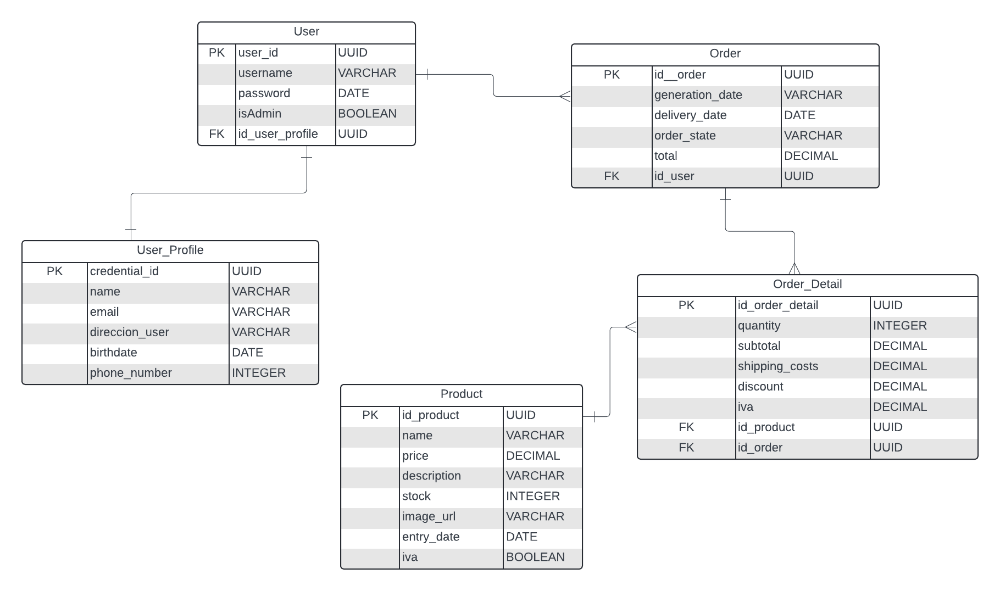

# PM4BE-omaryesithvilladiego - henry

Este repositorio contiene el proyecto del modulo 4 de Omar Villadiego en Henry.

# E-Commerce API

## Configuración Inicial

### 1. Clona el Repositorio
Para comenzar, clona el repositorio en tu máquina local:

git clone <URL_DEL_REPOSITORIO>
cd e-commerce

### 2. Crea el Archivo de Configuración

Renombra el archivo .development.example.env a .development.env. Este archivo contendrá todas tus configuraciones de entorno.
### 3. Configura las Variables de Entorno

Abre el archivo .development.env y configura las siguientes variables:

    APP_PORT=3000
    DB_HOST=localhost
    DB_PORT=5432
    DB_USERNAME=your_db_username
    DB_PASSWORD=your_db_password
    DB_NAME=e-commerce
    CLOUDINARY_CLOUD_NAME=your_cloud_name
    CLOUDINARY_API_KEY=your_cloud_api_key
    CLOUDINARY_API_SECRET=your_cloud_api_secret
    JWT_SECRET=estaesmiclave

Descripción de las Variables

    APP_PORT: El puerto en el que se ejecutará tu API (default: 3000).
    DB_HOST: La dirección del servidor de tu base de datos (default: localhost).
    DB_PORT: El puerto en el que tu base de datos escucha (default: 5432).
    DB_USERNAME: Tu nombre de usuario para acceder a la base de datos.
    DB_PASSWORD: La contraseña asociada con el DB_USERNAME.
    DB_NAME: El nombre de la base de datos utilizada por la aplicación (e-commerce).
    CLOUDINARY_CLOUD_NAME: El nombre de tu cuenta de Cloudinary.
    CLOUDINARY_API_KEY: Tu API KEY de Cloudinary.
    CLOUDINARY_API_SECRET: Tu API SECRET de Cloudinary.
    JWT_SECRET: La clave secreta para firmar los tokens JWT.

### 4. Ejecuta la Aplicación

Para iniciar el servidor, utiliza el siguiente comando:

bash:

npm run start:dev

### 5. Accede a la API

Una vez que el servidor esté corriendo, visita http://localhost:<your_port> en tu navegador para acceder a la API.

A continuación se presenta el diagrama de entidad-relación:

### Diagrama de entidad relación

